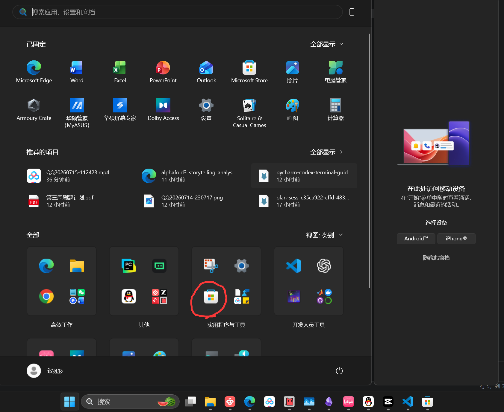
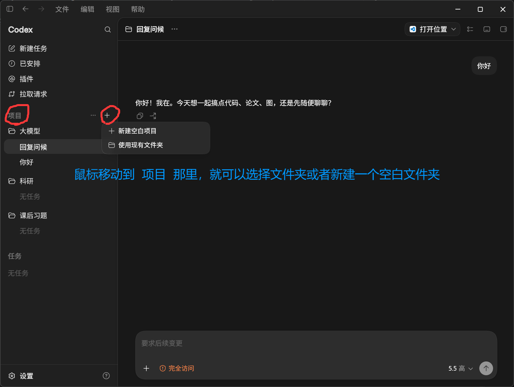
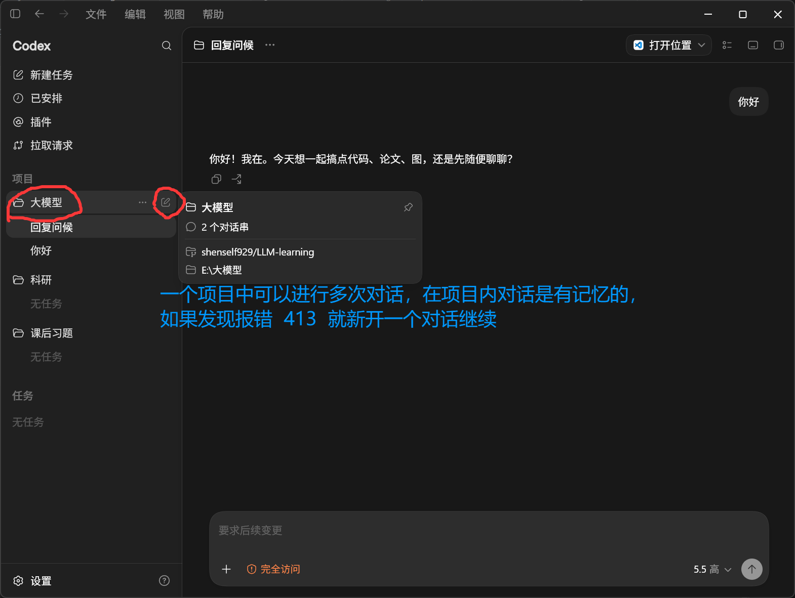
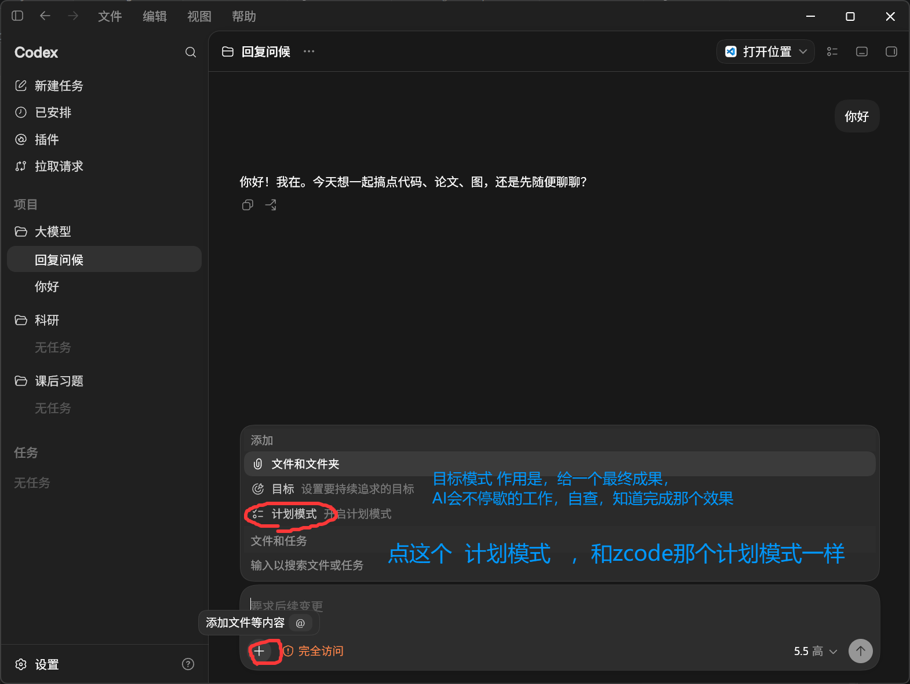

## 配置模型--打开vscode

#### 1.手动配置
#### **配置神马中转API作为第三方API**

Codex CLI 会读取你的配置文件：一般在 ~/.codex/（Windows 也是用户目录下的 .codex）。创建两份文件：

- auth.json：放密钥
    
- config.toml：放模型与网关配置


**auth.json（把 sk-xxx 换成你的神马中转API Key）**


```plaintext
{"OPENAI_API_KEY": "sk-xxx"}
```


**config.toml**


```plaintext

model_provider = "whatai"
model = "gpt-5-codex"
model_reasoning_effort = "high"
disable_response_storage = true
preferred_auth_method = "apikey"

[model_providers.whatai]
name = "whatai"
base_url = "https://api.whatai.cc/v1"
wire_api = "responses"
```

<mark>每次修改完内容需要按 ctrl+s 保存</mark>


#### 2.直接让codex配置
提示词：
```
帮我替换中转站api模型，具体信息如下:1.url:https://newapi.qwqtao.com/v1   2.api key:sk-XX   3.模型：glm-5.2[去模型广场看]
```

### codex应用软件
和 chat gpt合二为一了，需要在 微软商店 搜索 chatgpt 下载







