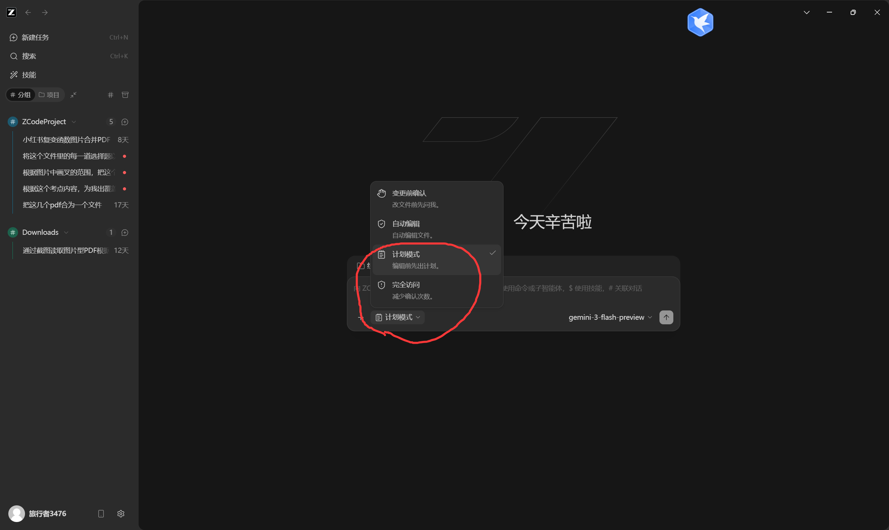

# 下载
[ZCode - 简单、迅捷、氛围十足 | GLM-5.2 官方适配开发工具](https://zcode.z.ai/cn)
点击即可

依然需要登陆

**注意及时检查更新**

# 中转api配置

# 关于在文件夹中进行agent的使用
一般选择==计划模式==

如果对运行的文件夹没有要求，则它默认的 ZCodeProject 就可以用

**如果有需要则**

## 如何删除生成的一些没有必要的文件
