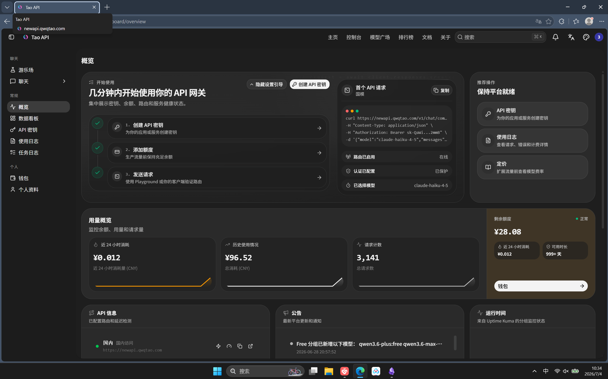
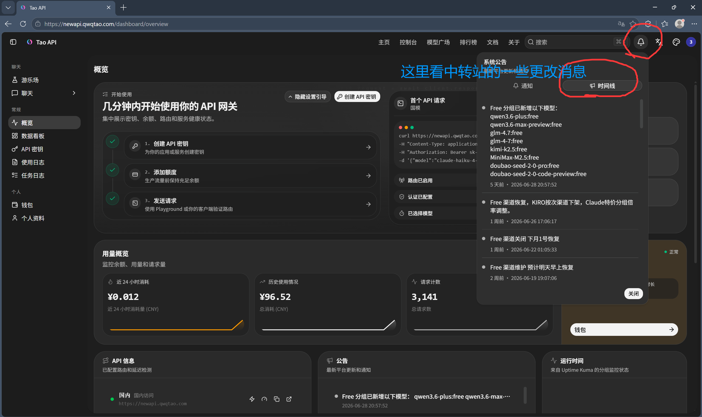
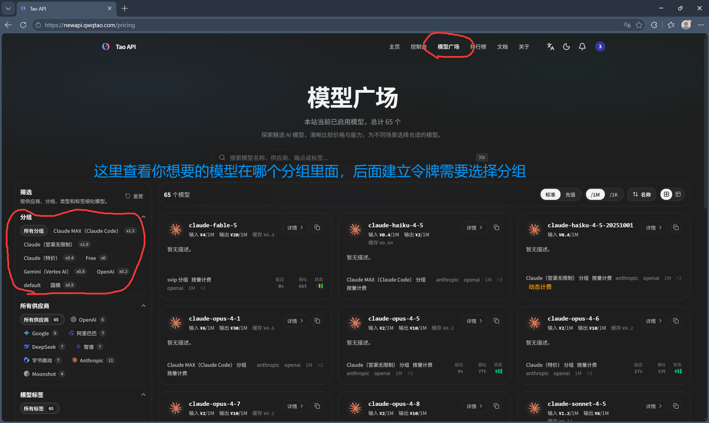
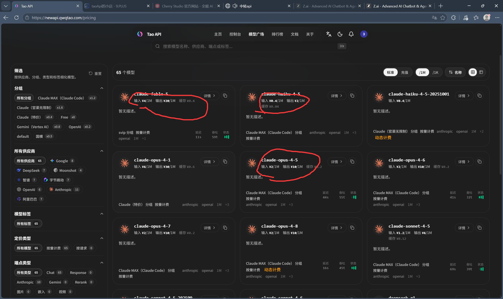
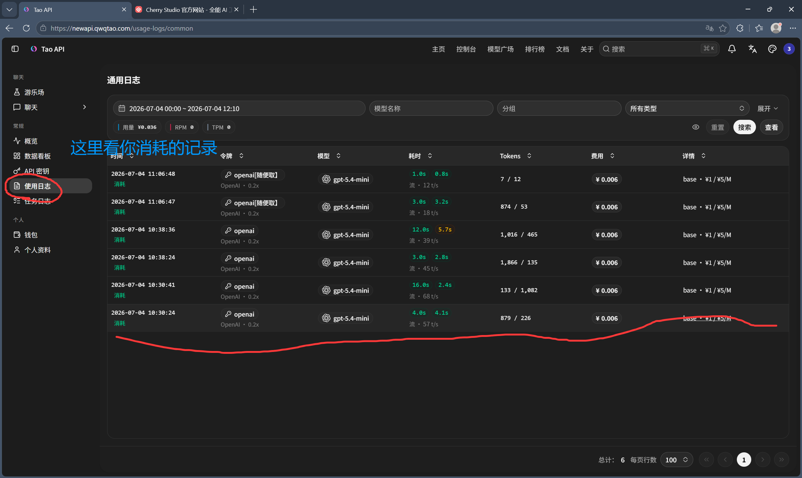
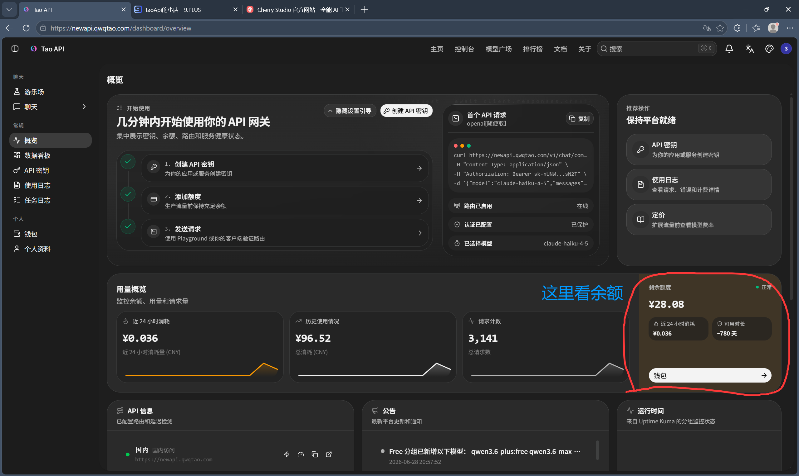

# 界面介绍
[中转api地址](https://newapi.qwqtao.com/sign-up?aff=uUVc)
点击最上面那里的控制台就能到这个界面

进入界面

#### 中转站通知的查看

#### 查看有哪些模型【模型广场】

##### 查看模型分组
free 组：即免费试用的模型
后面x0.4 ,x0.2:即指的倍率：乘的越小，即调用一次模型消耗额度得越少

##### 查看价格

一般claude 都比较贵，反正必要的时候用就行了

##### 模型推荐

- claude: fable 系列先不要用，把持不住；opus系列可以用，但少用，因为贵；sonnet系列比opus系列屁一点【总结：claude最好在gpt都无法做出的时候用，大任务的时候，这些数学建模题应该gpt就足够了，claude逻辑能力比较强，适合写高难度高工作量复杂度高的代码项目】【当然，分组这里有“claude(特价)"应该便宜一点
- Gemini：首用gemini-3.1-pro，平常小任务用flash系列
- openai分组：用gpt-5.5，小任务用gpt-5.4-mini
- 国模 分组：很多都不是多模态【可以读取图片视频等等的叫做多模态】
  多模态有：kimi 系列，doubao【不推荐】
  非多模态：推荐glm5.2【非常推荐】,deepseek-v4-pro，minimax-m3【使用非多模态，可以通过先把图片和文件或视频给多模态分析解读，或者直接解读，然后再切换非多模态模型进行解答
- free 分组：不花钱,但是模型比较拉跨，平时的作业可以问问，以前还有claude的免费模型，现在全是国产已经淘汰的模型，依然推荐glm,kimi

### 建立令牌【最重要的】

选择分组那个部分，就看你想要的模型在【模型广场】中在哪个组就选择哪个组
这个令牌创立主要是为了得到密钥，可以调用api

#### 如何运用api【以 cherry studio 为例】
[cherry studio下载地址](https://cherryai.com.cn)

最后那里不用管，我在找结束录制按钮，只要发出消息能正确吐字就行了
cherry studio 相当于一个聊天的，跟豆包差不多，只是可以用其他很多模型，接入中转api

### 使用日志【看使用记录】

### 怎么充值【我觉得20就完全足够使用了】

#### 查看余额

