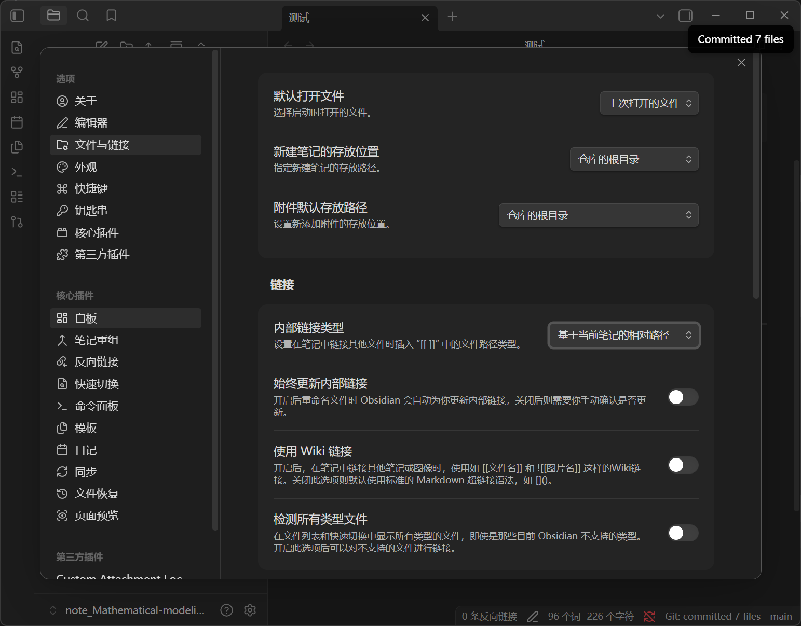

# 一级标题（#）
## 二级标题（##）
**加粗**（四个  *  号包裹）
~~删除线~~（四个 ~  ）
==高亮==（四个 = ）
```python
print("Hello")
```
(六个 反引号包裹是代码块--在 ~ 的下面，第一行写上编程语言名字)
>创建引用（大于号 `>`）


- 无序列表（`-`短横杠+空格）

1. 有序列表


---

（右键--插入-- 分隔线、表格、数学块）
$$
x=1
$$

# 图像




输入数字调整大小